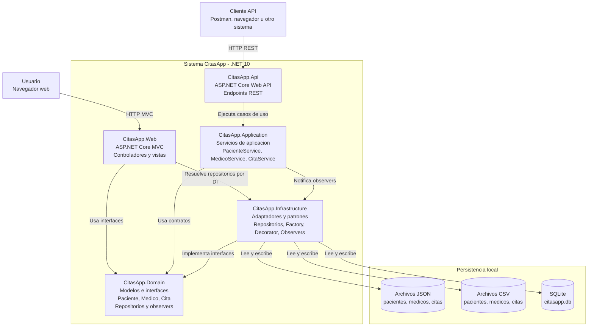

# ADR-01: Componentes principales de CitasApp

| Campo  | Valor |
|--------|-------|
| Autor  | Edwuard Chay |
| Fecha  | 07/07/2026 |
| Estado | `Aceptado` |

---

## Contexto

CitasApp es una aplicacion de citas medicas construida con .NET 10. El sistema permite consultar pacientes, medicos y citas, ademas de confirmar citas desde una API HTTP.

El proyecto esta organizado en varios proyectos de .NET para separar responsabilidades principales:

- `CitasApp.Web` expone una interfaz MVC para usuarios que navegan desde el navegador.
- `CitasApp.Api` expone endpoints REST para consumir la funcionalidad por HTTP.
- `CitasApp.Application` contiene servicios de aplicacion que coordinan casos de uso.
- `CitasApp.Domain` contiene modelos, contratos de repositorio y contratos de observadores.
- `CitasApp.Infrastructure` contiene adaptadores de persistencia, factory, decorator y observers concretos.

La decision relevante para el equipo tecnico es entender de que piezas grandes se compone el sistema y como se comunican. Para eso se documenta un diagrama C4 nivel 2, enfocado en componentes internos del contenedor de aplicacion.

---

## Decision

Se documenta CitasApp como un sistema compuesto por cinco componentes principales: Web MVC, API REST, Application Services, Domain e Infrastructure. La API usa la capa de aplicacion para ejecutar casos de uso, mientras que la Web MVC consume directamente los contratos del dominio mediante repositorios registrados por inyeccion de dependencias.

La infraestructura implementa los puertos definidos en el dominio y ofrece persistencia en archivos JSON, archivos CSV y SQLite. Tambien contiene implementaciones de patrones GOF usados por el proyecto: Factory Method, Decorator y Observer.

### Diagrama C4 nivel 2: Componentes

---

## Alternativas consideradas

| Alternativa | Por que no se eligio como documentacion principal |
|-------------|----------------------------------------------------|
| Diagrama C4 nivel 1: Contexto | Es util para explicar actores externos, pero no muestra las piezas tecnicas grandes del sistema. La necesidad actual es que el equipo tecnico entienda componentes internos. |
| Diagrama C4 nivel 3: Componentes detallados por clase | Seria demasiado detallado para esta decision. Incluir cada controlador, repositorio y observer puede dificultar ver la arquitectura general. |
| Diagrama de clases UML | Ayuda a ver modelos e interfaces, pero no explica claramente como se conectan Web, API, Application, Domain, Infrastructure y persistencia. |

---

## Consecuencias

**Lo que se gana:**

- El equipo tecnico puede ver rapidamente las piezas grandes del sistema y sus dependencias.
- La separacion entre `Domain`, `Application` e `Infrastructure` queda explicita.
- Se documenta que la API y la Web no siguen exactamente el mismo flujo interno: la API pasa por servicios de aplicacion, mientras que la Web MVC usa repositorios directamente.
- El diagrama deja visible que la infraestructura concentra persistencia y patrones GOF.

**Lo que se asume o queda como deuda:**

- El README y la implementacion deben mantenerse alineados con este ADR si cambia la persistencia o el flujo de dependencias.
- La Web MVC podria migrarse despues para usar `CitasApp.Application`, igual que la API, y asi unificar el flujo de casos de uso.
- La persistencia mixta JSON, CSV y SQLite puede generar datos inconsistentes si no se define una fuente oficial para cada entorno.

---

## Notas

Este ADR describe el estado arquitectonico actual del proyecto. No pretende documentar cada clase, sino las piezas principales que permiten entender como esta armado el sistema a nivel de componentes.
